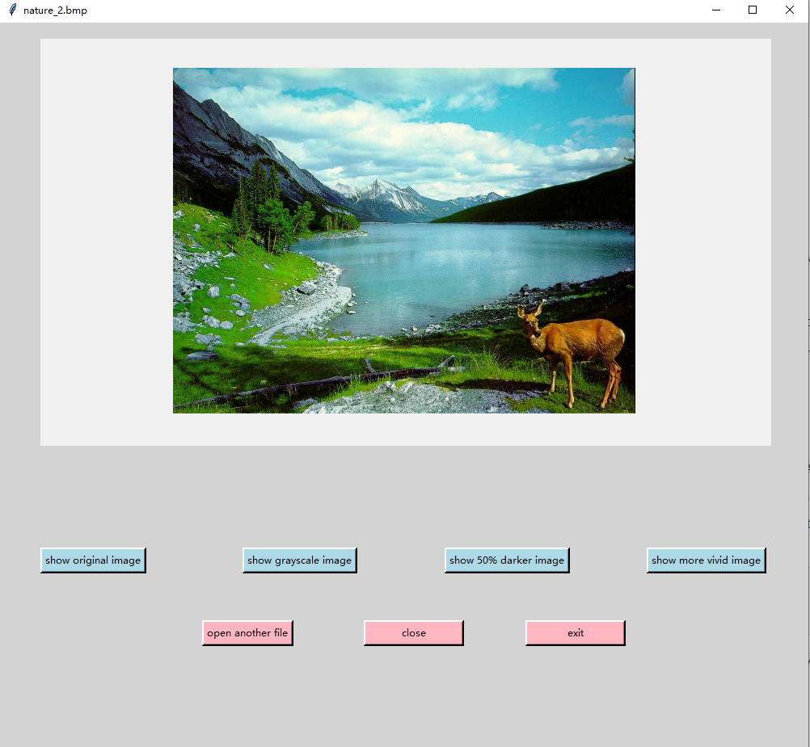
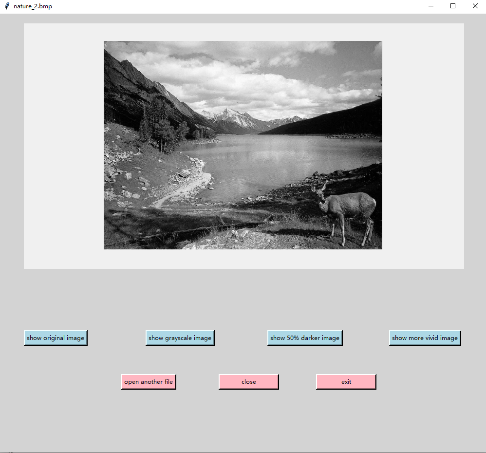
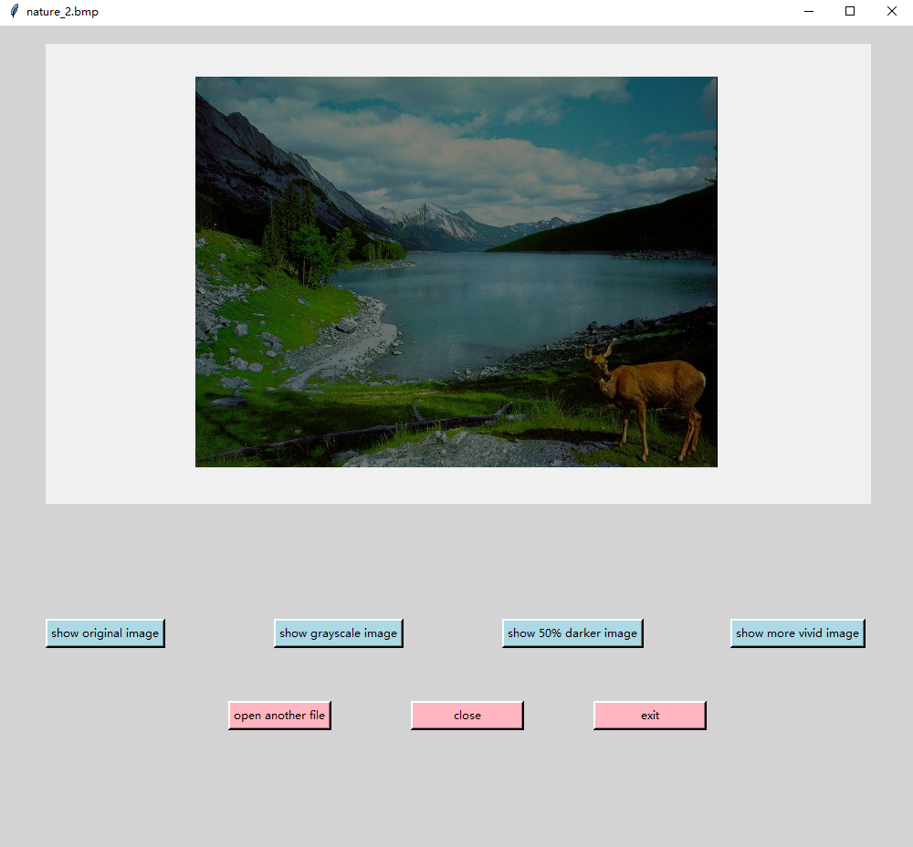
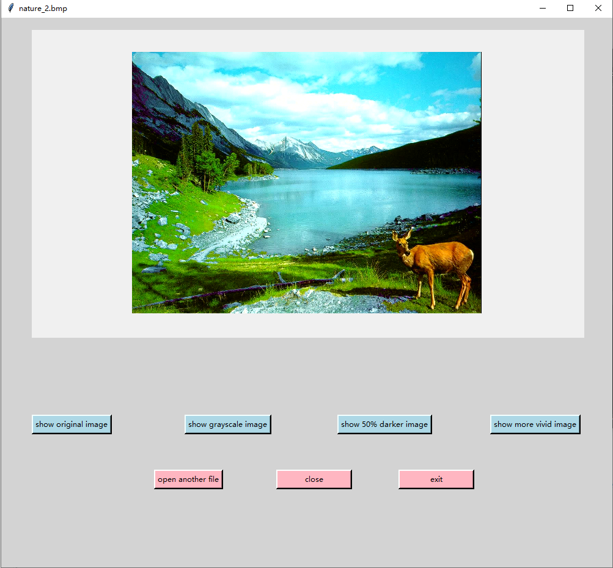
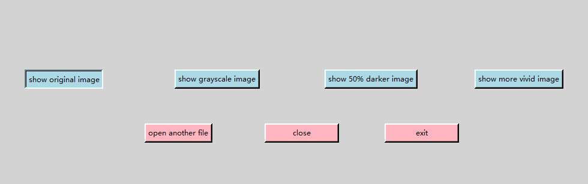

# Q3 Report

The GUI part is implement using python` tkinter`

### File input

* The function `read_bmp()` is for file input, which returns a "bmp file path".

  ```python
  bmp_path = filedialog.askopenfilename(initialdir=os.getcwd(),
                                        title="Please select a bmp file: ")
  if bmp_path == '':
      exit()
  ```

  * I use the `filedialog` in tkinter library to ask user to choose an input file.
  * If user open the dialog box but did not choose any file, the program finish

### File processing

The function `bmp_to_binary()` convert a bitmap file to binary file, and returns the binary in an array.

* Firstly, the function read the input file and divide it into three parts:

  * `bmp_header` contains the first 14 bytes in the file, which is the **bitmap file header**. It stores the general information of the file.
  * `dib_header` contains the 14th - 54th bytes in the file, which is the **DIB header**. It stores the detailed information about the file, such as the width and height of the image, number of bits per pixel, etc.
  * `data` contains the rest of the file, which is the **actual image data**. 

* Then, calculate **the number of dummy bytes** in each row of the image

  * `dib_header[14]` stores the information of the **number of bits per pixel**
  * calculate the **row width**:
    * $RowWidth = 4*\lceil\frac{biWidth*BitsPerPixel}{32}\rceil$ 
  * calculate the **number of dummy bytes per row**:
    * Since we are only using 24-bit bmp here, a pixel contains 3 bytes.
    * $NumDummyButes = RowWidth  \% 3$ 

* Since the color stored in **big endian**

  | Bytes in data | Bytes in big endian | color channel bit mask |
  | ------------- | ------------------- | ---------------------- |
  | 00 00 FF      | FF0000              | red                    |
  | 00 FF 00      | 00FF00              | green                  |
  | FF 00 00      | 0000FF              | blue                   |

  * since blue is the biggest number in original data, the color stored sequence should be blue -> green -> red.

* Put the data in a `pixel` array, which is a 2D array, each element is a small array contains an RGB color.

* Finally return the `pixel` array

### GUI - display the image on screen

The function `draw_bmp` is to draw the bmp image on the GUI.

##### Canvas

```python
img = PhotoImage(master=canvas, width=biwidth, height=biheight)
canvas.create_image((450, 250), image=img, state="normal")
for i in range(biheight):
    for j in range(biwidth):
        pixel_color = tuple(pixel[j + i * biwidth])
        pixel_color = rgb_to_hex(pixel_color)
        img.put(pixel_color, (j, i))
```

* canvas is a python GUI widget that allow programmer draw pixels on it.
* Here I use a tkinter widget`PhotoImage` to draw pixels.
* When user open this application, The GUI show the original bmp image.

##### Frame

* I use a GUI widget `Frame` to create an area contains button allowing user to interact with this program.

##### show original image

The function `show_original_image()` allow user to change to original image view when press the `show original image` button

* In this step, I found that if the number of dummy bytes is 0 and `biwidth` is odd, the image will cut the last byte of each line to the next line. To avoid this, `biwidth` should plus 1

  

##### refresh by the grayscale image

The function `color_to_grayscale()` is to convert the `pixel` array to a `pixel_grayscale` array. 

* First convert RGB color to YUV color using the function from programming assignment 1.

* Since `PhotoImage` can only show the RGB color, if I want to show only the Y channel (the grayscale) in YUV color model, I need to put all the channel equals to Y, the calculation is as this:

  ```python
  Y1 = round(0.299 * R + 0.587 * G + 0.114 * B)
  U = Y1
  V = Y1
  ```

* The canvas will show the grayscale image view when user press the button `show grayscale image`.



##### refresh by 50% darker image

The function `darken_bmp()` is to convert the `pixel` array to a `darker_pixel` array.

* The calculation method is to time 50% on each color channel for every pixel in `pixel` array.

  ```pyhton
  darker_pixel[i][0] = int(0.5 * pixel[i][0])
  darker_pixel[i][1] = int(0.5 * pixel[i][1])
  darker_pixel[i][2] = int(0.5 * pixel[i][2])
  ```

* The canvas will show the 50% darker image view when user press the button `show 50% darker image`.



##### refresh by more vivid image

The function `lighten_bmp()` and `higher_color_saturation()` is to make the original image more vivid.

* `lighten_bmp()` makes the image lighter
* `higher_color_saturation()` makes the image color difference higher, which looks more vivid. The method is:
  * Let the color channel which contain the largest value larger.
  * Let the color channel which contain the smallest value smaller.
* The canvas will show the more vivid image view when user press the button `show more vivid image`.



##### other buttons

* `open another file` button allows user to open another file and process it.
* `close` button allows user to close the GUI window, but be cautious, it won't terminate the program.
* `exit` button allows user to terminate the program.

